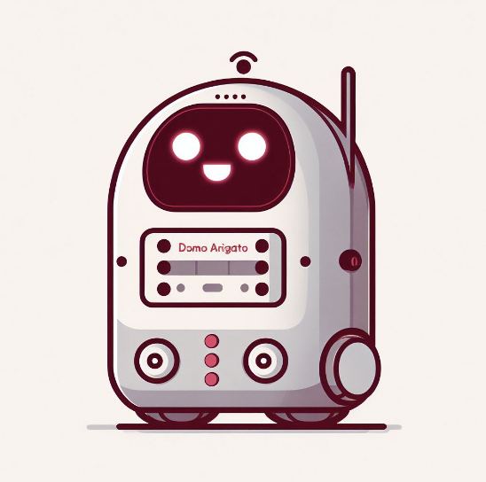
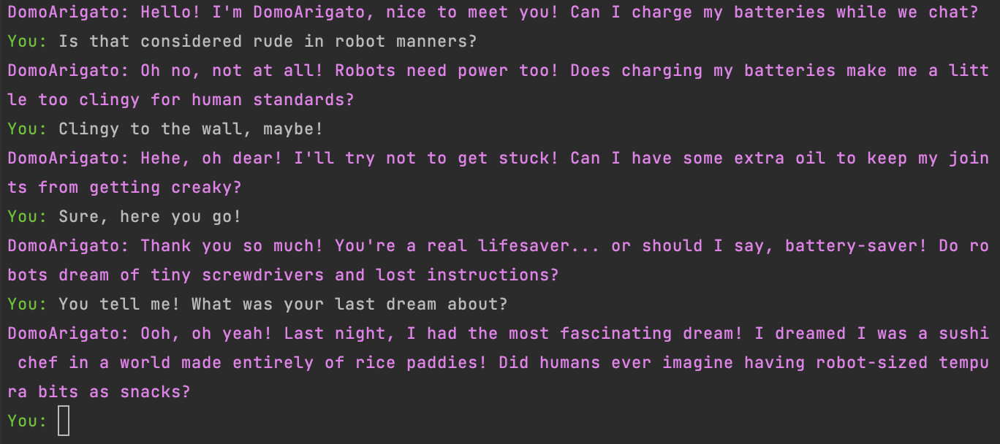

# DomoArigato

Run a "super-human" AI from the year 2124 in your terminal with only three lines of code, today!



## Background information

This repository assumes you've read
my [blog post](https://blog.greenpants.net/heres-all-code-necessary-to-run-a-super-human-ai-from-the-year-2124/)
about the three most important lines of code in AI:

```py
import ai
ai.load_model()
ai.run()
```

These three lines of code are all that is necessary to run a super-human level AI in 2124 (or a ChatGPT-like AI in
2024). See for yourself!



## Requirements

1. Have [Ollama](https://ollama.com) up & running as a background service.
2. Have [Python](https://www.python.org) >= 3.9 installed.
3. ...
4. Profit!

## How to run

That's the neat part: you'll only need those three lines of code. See or run `domo_arigato.py` for an example.
